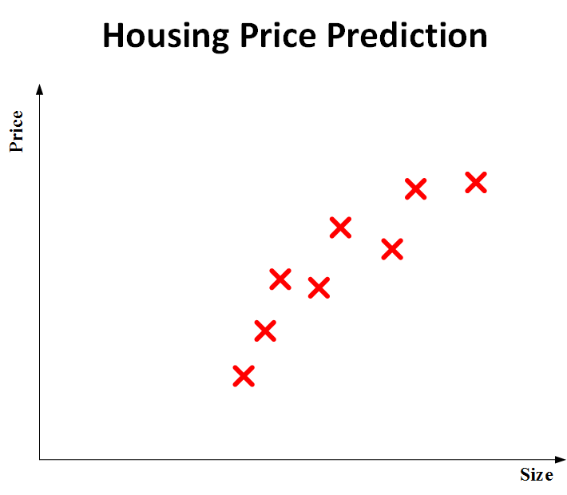
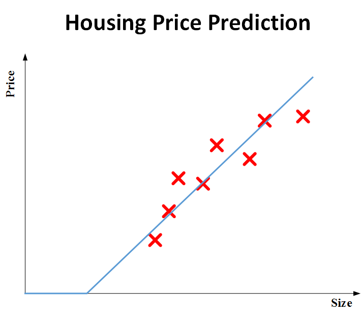
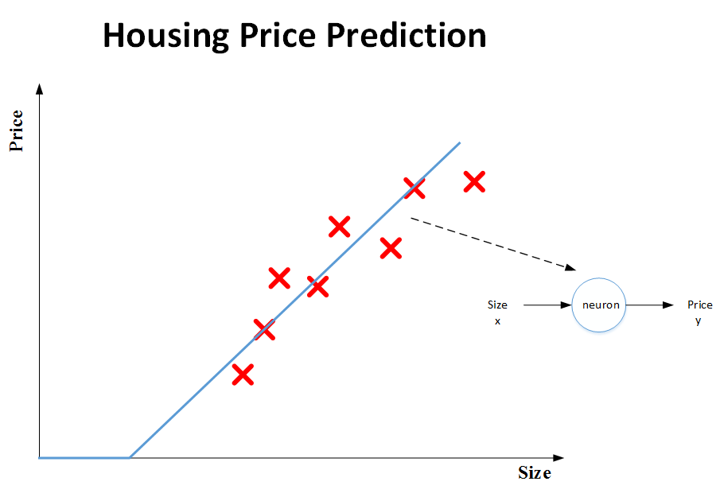
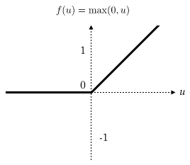
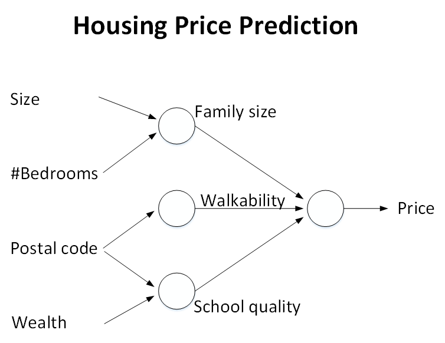
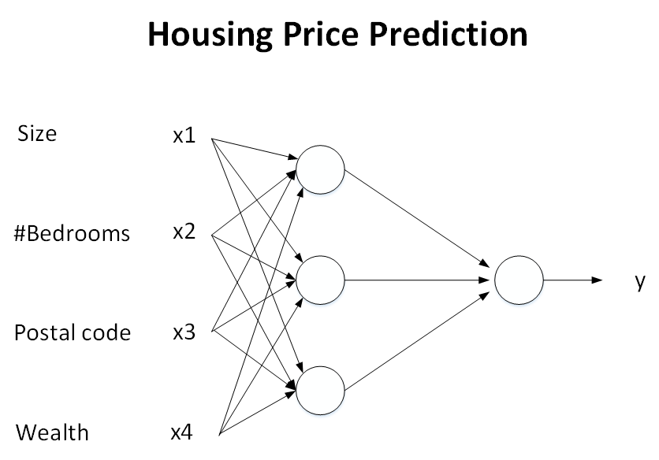
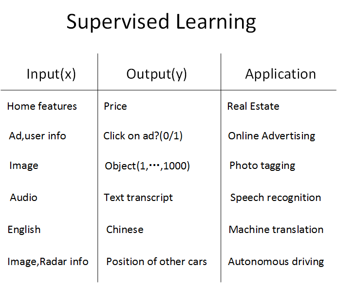
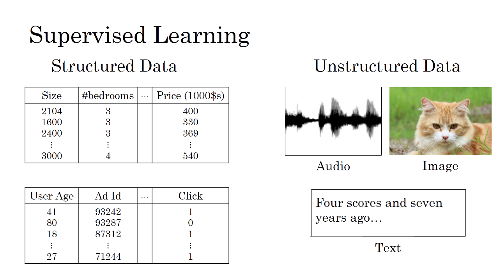
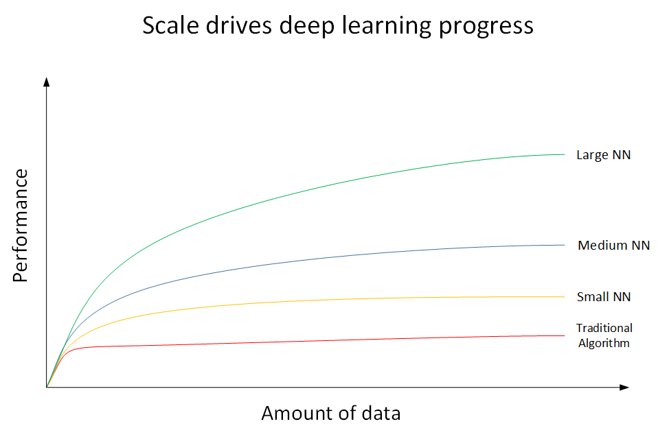

# 神经网络与深度学习
# less1 概述

课程地址：https://www.coursera.org/specializations/deep­learning

## What is a neural network?

简单来说，深度学习（Deep Learning）就是更复杂的神经网络（Neural Network）。  
那么，什么是神经网络呢？下面我们将通过一个简单的例子来引入神经网络模型的概念。  

假如我们要建立房价的预测模型，一共有六个房子。我们已知输入x即每个房子的面积（多少尺或者多少平方米），还知道其对应的输出y即每个房子的价格。根据这些输入输出，我们要建立一个函数模型，来预测房价：y=f(x)。首先，我们将已知的六间房子的价格和面积的关系绘制在二维平面上，如下图所示：  

  

一般地，我们会一条直线来拟合图中这些离散点，即建立房价与面积的线性模型。但是从实际考虑，我们知道价格永远不会是负数。所以，我们对该直线做一点点修正，让它变成折线的形状，当面积小于某个值时，价格始终为零。如下图蓝色折线所示，就是我们建立的房价预测模型。  

  

其实这个简单的模型（蓝色折线）就可以看成是一个神经网络，而且几乎是一个最简单的神经网络。我们把该房价预测用一个最简单的神经网络模型来表示，如下图所示：  

  

该神经网络的输入x是房屋面积，输出y是房屋价格，中间包含了一个神经元（neuron），即房价预测函数（蓝色折线）。该神经元的功能就是实现函数f(x)的功能。  

值得一提的是，上图神经元的预测函数（蓝色折线）在神经网络应用中比较常见。我们把这个函数称为ReLU函数，即线性整流函数（Rectified Linear Unit），形如下图所示：  

  

上面讲的只是由单个神经元（输入x仅仅是房屋面积一个因素）组成的神经网络，而通常一个大型的神经网络往往由许多神经元组成，就像通过乐高积木搭建复杂物体（例如火车）一样。  

现在，我们把上面举的房价预测的例子变得复杂一些，而不是仅仅使用房屋面积一个判断因素。例如，除了考虑房屋面积（size）之外，我们还考虑卧室数目（#bedrooms）。这两点实际上与家庭成员的个数（family size）有关。还有，房屋的邮政编码（zip code/postal code），代表了该房屋位置的交通便利性，是否需要步行还是开车？即决定了可步行性（walkability）。另外，还有可能邮政编码和地区财富水平（wealth）共同影响了房屋所在地区的学校质量（school quality）。如下图所示，该神经网络共有三个神经元，分别代表了family size，walkability和school quality。每一个神经元都包含了一个ReLU函数（或者其它非线性函数）。那么，根据这个模型，我们可以根据房屋的面积和卧室个数来估计family size，根据邮政编码来估计walkability，根据邮政编码和财富水平来估计school quality。最后，由family size，walkability和school quality等这些人们比较关心的因素来预测最终的房屋价格。  

  

所以，在这个例子中，x是size，#bedrooms，zip code/postal code和wealth这四个输入；y是房屋的预测价格。这个神经网络模型包含的神经元个数更多一些，相对之前的单个神经元的模型要更加复杂。那么，在建立一个表现良好的神经网络模型之后，在给定输入x时，就能得到比较好的输出y，即房屋的预测价格。  

实际上，上面这个例子真正的神经网络模型结构如下所示。它有四个输入，分别是size，#bedrooms，zip code和wealth。在给定这四个输入后，神经网络所做的就是输出房屋的预测价格y。图中，三个神经元所在的位置称之为中间层或者隐藏层（x所在的称之为输入层，y所在的称之为输出层），每个神经元与所有的输入x都有关联（直线相连）。  

  

这就是基本的神经网络模型结构。在训练的过程中，只要有足够的输入x和输出y，就能训练出较好的神经网络模型，该模型在此类房价预测问题中，能够得到比较准确的结果。  

## Supervised Learning with Neural Networks

目前为止，由神经网络模型创造的价值基本上都是基于监督式学习（Supervised Learning）的。监督式学习与非监督式学习本质区别就是是否已知训练样本的输出y。在实际应用中，机器学习解决的大部分问题都属于监督式学习，神经网络模型也大都属于监督式学习。下面我们来看几个监督式学习在神经网络中应用的例子。首先，第一个例子还是房屋价格预测。根据训练样本的输入x和输出y，训练神经网络模型，预测房价。第二个例子是线上广告，这是深度学习最广泛、最赚钱的应用之一。其中，输入x是广告和用户个人信息，输出y是用户是否对广告进行点击。神经网络模型经过训练，能够根据广告类型和用户信息对用户的点击行为进行预测，从而向用户提供用户自己可能感兴趣的广告。第三个例子是电脑视觉（computer vision）。电脑视觉是近些年来越来越火的课题，而电脑视觉发展迅速的原因很大程度上是得益于深度学习。其中，输入x是图片像素值，输出是图片所属的不同类别。第四个例子是语音识别（speech recognition）。深度学习可以将一段语音信号辨识为相应的文字信息。第五个例子是智能翻译，例如通过神经网络输入英文，然后直接输出中文。除此之外，第六个例子是自动驾驶。通过输入一张图片或者汽车雷达信息，神经网络通过训练来告诉你相应的路况信息并作出相应的决策。至此，神经网络配合监督式学习，其应用是非常广泛的。  

  

我们应该知道，根据不同的问题和应用场合，应该使用不同类型的神经网络模型。例如上面介绍的几个例子中，对于一般的监督式学习（房价预测和线上广告问题），我们只要使用标准的神经网络模型就可以了。而对于图像识别处理问题，我们则要使用卷积神经网络（Convolution Neural Network），即CNN。而对于处理类似语音这样的序列信号时，则要使用循环神经网络（Recurrent Neural Network），即RNN。还有其它的例如自动驾驶这样的复杂问题则需要更加复杂的混合神经网络模型。  

CNN和RNN是比较常用的神经网络模型。下图给出了Standard NN，Convolutional NN和Recurrent NN的神经网络结构图。  

  

CNN一般处理图像问题，RNN一般处理语音信号。他们的结构是什么意思？如何实现CNN和RNN的结构？这些问题我们将在以后的课程中来深入分析并解决。  

另外，数据类型一般分为两种：Structured Data和Unstructured Data。  

  

简单地说，Structured Data通常指的是有实际意义的数据。例如房价预测中的size，#bedrooms，price等；例如在线广告中的User Age，Ad ID等。这些数据都具有实际的物理意义，比较容易理解。而Unstructured Data通常指的是比较抽象的数据，例如Audio，Image或者Text。以前，计算机对于Unstructured Data比较难以处理，而人类对Unstructured Data却能够处理的比较好，例如我们第一眼很容易就识别出一张图片里是否有猫，但对于计算机来说并不那么简单。现在，值得庆幸的是，由于深度学习和神经网络的发展，计算机在处理Unstructured Data方面效果越来越好，甚至在某些方面优于人类。总的来说，神经网络与深度学习无论对Structured Data还是Unstructured Data都能处理得越来越好，并逐渐创造出巨大的实用价值。我们在之后的学习和实际应用中也将会碰到许多Structured Data和Unstructured Data。  

## Why is Deep Learning taking off？

如果说深度学习和神经网络背后的技术思想已经出现数十年了，那么为什么直到现在才开始发挥作用呢？接下来，我们来看一下深度学习背后的主要动力是什么，方便我们更好地理解并使用深度学习来解决更多问题。  

深度学习为什么这么强大？下面我们用一张图来说明。如下图所示，横坐标x表示数据量（Amount of data），纵坐标y表示机器学习模型的性能表现（Performance）。  

  

上图共有4条曲线。其中，最底下的那条红色曲线代表了传统机器学习算法的表现，例如是SVM，logistic regression，decision tree等。当数据量比较小的时候，传统学习模型的表现是比较好的。但是当数据量很大的时候，其表现很一般，性能基本趋于水平。红色曲线上面的那条黄色曲线代表了规模较小的神经网络模型（Small NN）。它在数据量较大时候的性能优于传统的机器学习算法。黄色曲线上面的蓝色曲线代表了规模中等的神经网络模型（Media NN），它在在数据量更大的时候的表现比Small NN更好。最上面的那条绿色曲线代表更大规模的神经网络（Large NN），即深度学习模型。从图中可以看到，在数据量很大的时候，它的表现仍然是最好的，而且基本上保持了较快上升的趋势。值得一提的是，近些年来，由于数字计算机的普及，人类进入了大数据时代，每时每分，互联网上的数据是海量的、庞大的。如何对大数据建立稳健准确的学习模型变得尤为重要。传统机器学习算法在数据量较大的时候，性能一般，很难再有提升。然而，深度学习模型由于网络复杂，对大数据的处理和分析非常有效。所以，近些年来，在处理海量数据和建立复杂准确的学习模型方面，深度学习有着非常不错的表现。然而，在数据量不大的时候，例如上图中左边区域，深度学习模型不一定优于传统机器学习算法，性能差异可能并不大。  

所以说，现在深度学习如此强大的原因归结为三个因素：  
- Data
- Computation
- Algorithms

其中，数据量的几何级数增加，加上GPU出现、计算机运算能力的大大提升，使得深度学习能够应用得更加广泛。另外，算法上的创新和改进让深度学习的性能和速度也大大提升。举个算法改进的例子，之前神经网络神经元的激活函数是Sigmoid函数，后来改成了ReLU函数。之所以这样更改的原因是对于Sigmoid函数，在远离零点的位置，函数曲线非常平缓，其梯度趋于0，所以造成神经网络模型学习速度变得很慢。然而，ReLU函数在x大于零的区域，其梯度始终为1，尽管在x小于零的区域梯度为0，但是在实际应用中采用ReLU函数确实要比Sigmoid函数快很多。

构建一个深度学习的流程是首先产生Idea，然后将Idea转化为Code，最后进行Experiment。接着根据结果修改Idea，继续这种Idea­>Code­>Experiment的循环，直到最终训练得到表现不错的深度学习网络模型。如果计算速度越快，每一步骤耗时越少，那么上述循环越能高效进行。  

## About this Course

这里简单列一下本系列深度学习专项课程有哪些：  

- Neural Networks and Deep Learning
- Improving Deep Neural Networks: Hyperparameter tuning, Regularization and Optimization
- Structuring your Machine Learning project
- Convolutional Neural Networks
- Natural Language Processing: Building sequence models

目前我们正在学习的是第一门课《Neural Networks and Deep Learning》。Coursera上关于这门课的教学日程安排如下：  

- Week 1: Introduction
- Week 2: Basics of Neural Network programming
- Week 3: One hidden layer Neural Networks
- Week 4: Deep Neural Networks

这门课我打算用5次笔记进行总结。  

## Summary

本节课的内容比较简单，主要对深度学习进行了简要概述。首先，我们使用房价预测的例子来建立最简单的但个神经元组成的神经网络模型。然后，我们将例子复杂化，建立标准的神经网络模型结构。接着，我们从监督式学习入手，介绍了不同的神经网络类型，包括Standard NN，CNN和RNN。不同的神经网络模型适合处理不同类型的问题。对数据集本身来说，分为Structured Data和Unstructured Data。近些年来，深度学习对Unstructured Data的处理能力大大提高，例如图像处理、语音识别和语言翻译等。最后，我们用一张对比图片解释了深度学习现在飞速发展、功能强大的原因。归纳其原因包含三点：Data，Computation和Algorithms。  
